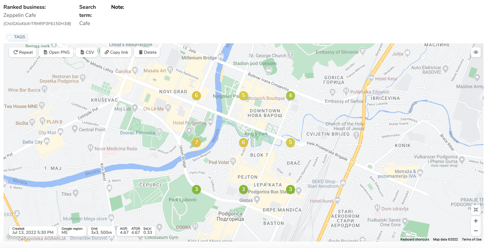
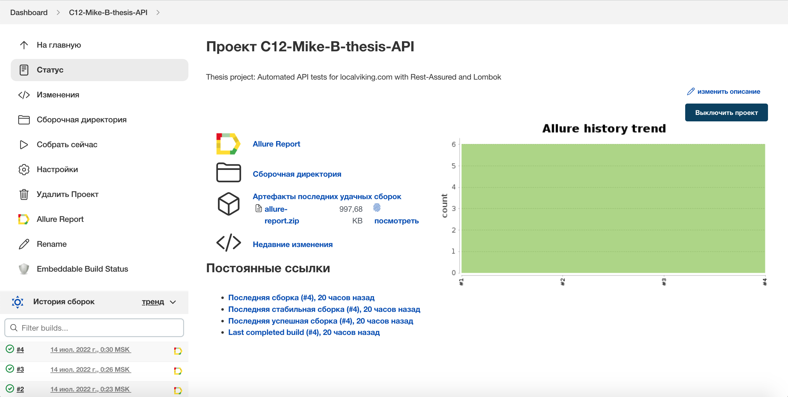
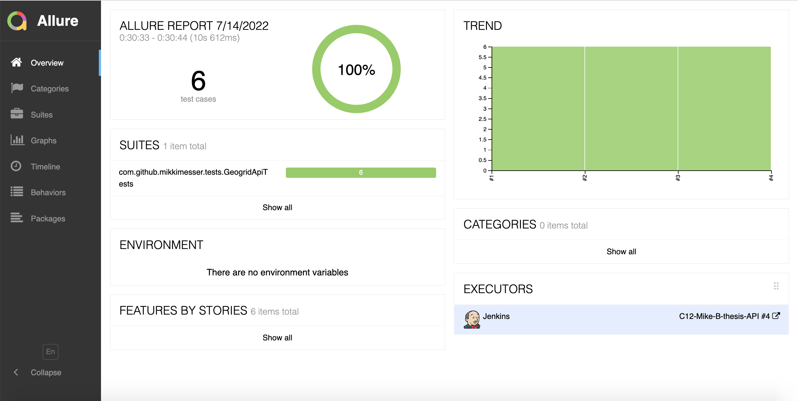
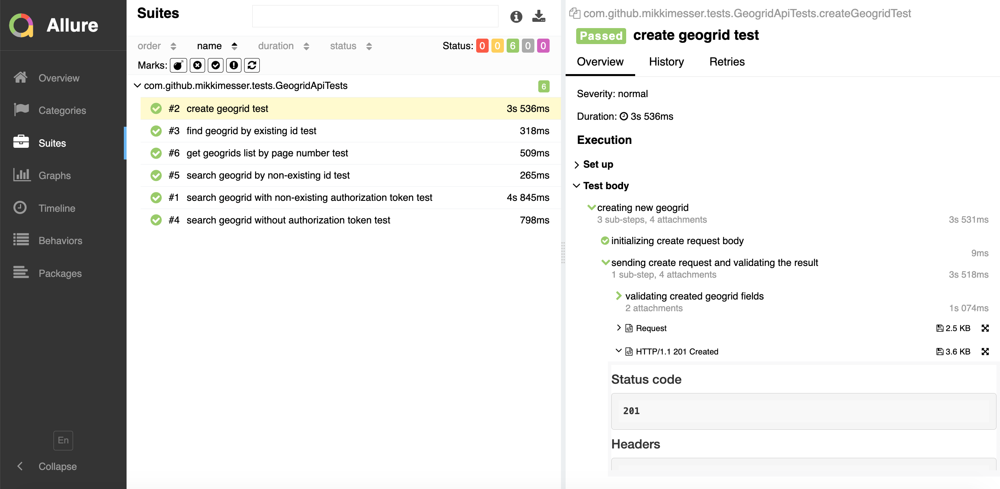
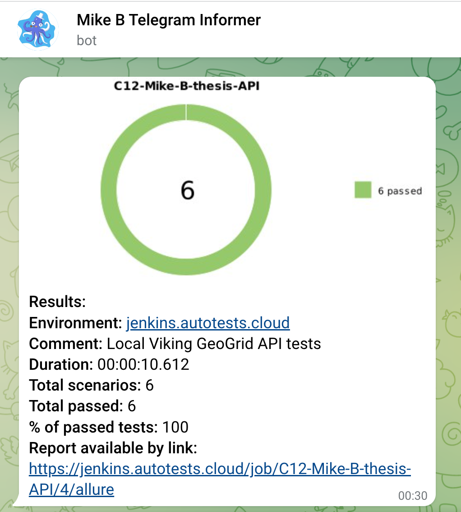

# Automated tests for the localviking.com GeoGrid API

## <a href = "https://localviking.com" target ="_blank">localviking.com</a>

<p align="center">

</p>

## :crossed_swords: Contents

- <a href="#crossed_swords-introduction">Introduction</a>
- <a href="#crossed_swords-coverage">Coverage</a>
- <a href="#crossed_swords-technology-stack">Technology stack</a>
- <a href="#crossed_swords-how-to-launch-from-the-command-line">How to launch from the command line</a>
  - <a href="#gear-required-credentials">Required credentials</a>
  - <a href="#gear-credentials.properties-example">Credentials.properties example</a> 
  - <a href="#gear-prepare-test-data">Prepare test data</a>
  - <a href="#gear-launch">Launch</a>
- <a href="#crossed_swords-jenkins-build-example">Jenkins build example</a>
- <a href="#crossed_swords-allure-reports-integration">Allure reports integration</a>
- <a href="#crossed_swords-telegram-Notification">Telegram Notification</a>

## :crossed_swords: Introduction

<p>
Local Viking is one of the most popular Google My Business software management platforms. 
It allows schedule GMB Posts, track location rankings, upload photos, and manage reviews and Q&A 
– all from a single dashboard. GeoGrid rank tracker is one of the most popular features of Local Viking. 
It provides an opportunity to see the visibility of a GMB listing for a specific keyword from a number of different
latitude and longitude coordinates, in other words, it gives a view of how GMB Listing ranks from different positions
across one geographic area (a square to be precise).
</p>
<p>
More information: <a href="https://help.localviking.com/en/articles/2893952-geogrid-rank-tracking-explained" target="_blank">help.localviking.com</a>
</p>
<p align="center">

</p>

## :crossed_swords: Coverage

- Check that GET request to the `/geogrids/:id` endpoint with the `:id` of the GeoGrid existing in the database and valid authorization token returns the Geogrid
- Check that GET request to the `/geogrids/:id` endpoint with the `:id` of the GeoGrid existing in the database and non-existing authorization token gets 403 result code
- Check that GET request to the `/geogrids/:id` endpoint with the `:id` of the GeoGrid existing in the database and without authorization token gets 403 result code
- Check that GET request to the `/geogrids/:id` endpoint with the `:id` of the GeoGrid non-existing in the database and valid authorization token get 404 result code
- Check that GET request to the `/geogrids` endpoint with the `page` query parameter returns the array of Geogrids from the specific page
- Check that POST request to the `/geogrids` endpoint with the GeoGrid data in the body creates the GeoGrid

## :crossed_swords: Technology stack

<p align="center">


</p>

## :crossed_swords: How to launch from the command line

### :gear: Required credentials

- `authorizationToken` - a valid authorization token for Local Viking API
- `nonExistingAuthorizationToken` - an example of 100%-incorrect authorization token
- `baseUrl` - a URL for access to the Local Viking API server
- `geogrids` - a default path for access to the Local Viking GeoGrid API

The credentials might be passed via the `system properties` or via the `src/test/resources/configuration/credentials.properties` file.

### :gear: Credentials.properties example

>Put your real valid authorization token there. Feel free to change the `nonExistingAuthorizationToken` value to avoid the `pesticide paradox`.

```
baseUrl=https://api.localviking.com
geogridsBasePath=/geogrids
authorizationToken=myAwesomeLVApiToken
nonExistingAuthorizationToken=nonexistingToken
```

### :gear: Prepare test data

The test data is passed via the `src/test/resources/configuration/testData.properties` file

Required test data:
- `business_name` - String. Required for the Create GeoGrid test. The name of the business to build the GeoGrid for.
- `business_place_id` - String. Required for the Create GeoGrid test. The Google PlaceId of the business to build the GeoGrid for. You can get it here: <a href = "https://developers.google.com/maps/documentation/javascript/examples/places-placeid-finder" target = "_blank">https://developers.google.com/maps/documentation/javascript/examples/places-placeid-finder</a>.
- `grid_center_lat` - Double. Required for the Create GeoGrid test. The latitude of the GeoGrid center.
- `grid_center_lng` - Double. Required for the Create GeoGrid test. The longitude of the GeoGrid center.
- `grid_size` - Integer. Required for the Create GeoGrid test. The size of the GeoGrid. Supported values: 3, 5, 7, 9, 13. 
- `grid_distance_measure` - String. Required for the Create GeoGrid test. The unit of distance between the GeoGrid nodes. Supported values: meters, miles.
- `grid_point_distance` - Double. Required for the Create GeoGrid test. The distance between the GeoGrid nodes. Supported values: meters - 100, 200, 500, 1000, 2500, 5000, 10000, 25000. miles - 0.1, 0.25, 0.5, 0.75, 1, 2, 3, 5, 8, 10.
- `business_country` - String. Required for the Create GeoGrid test. Two-character ISO-code of the business country.
- `search_term` - String. Required for the Create GeoGrid test. The keyword to check the visibility of the business for.
- `local_language_enabled` - Boolean. Required for the Create GeoGrid test. The switch pointing if the tracker should use Global or Local Google site (if available).
- `existingGeogridId` - String. Required for the Search Existing GeoGrid test. The id of the GeoGrid existing in the organization where the authorization token was issued.
- `nonExistingGeogridId` - String. Required for the Search Non-Existing GeoGrid test. The example of GeoGrid id that doesn't exist in the organization where the authorization token was issued.
- `geogridListPageNumber` - Integer. Required for the Get The List of GeoGrids From the page. The number of the page of the GeoGrid list. Minimum value = 1.

### :gear: Launch

Launch without the `src/test/resources/configuration/credentials.properties` file

```
gradle clean test -DbaseUrl=https://api.lvstaging.space -DgeogridsBasePath=/geogrids -DauthorizationToken=rXaDWNuckawj7oGqmSK2vS4W -DnonExistingAuthorizationToken=nonexistingToken
```

Launch with the `src/test/resources/configuration/credentials.properties` file

```
gradle clean test
```

## :crossed_swords: Jenkins build example

<p align="center">

</p>

## :crossed_swords: Allure reports integration

### :gear: Overview

<p align="center">

</p>

### :gear: Test Suites

<p align="center">

</p>

## :crossed_swords: Telegram Notification example

> <a href="https://github.com/qa-guru/allure-notifications">qa-guru/allure-notifications</a> is used.

<p align="center">

</p>


